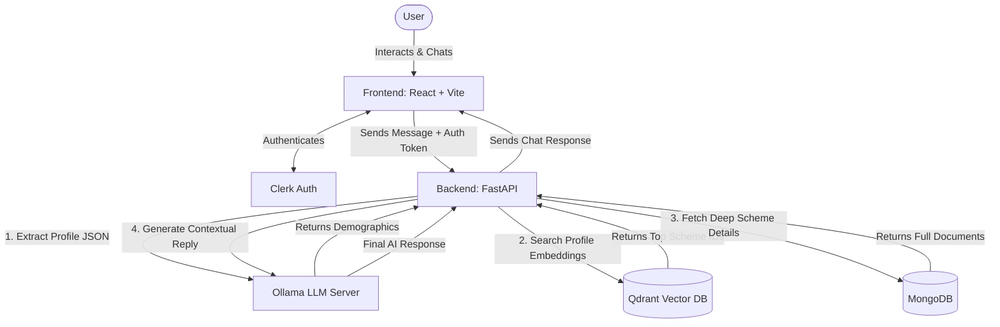

# NariConnect AI: Intelligent Scheme Matching (SheLeads 2.0)

NariConnect (developed by Team CodeCorps for the LeadHer track) is an AI-powered Women Scheme Matching Engine designed to connect Indian women to the most relevant government financial programs. By intelligently processing user profiles, the platform bridges the awareness gap, reduces information barriers, and promotes financial inclusion.

## 🌟 Key Features

* **AI-Powered Scheme Matching Engine:** Intelligently connects women to suitable central and state financial schemes based on specific user details like state, age, income, occupation, and purpose (e.g., business, education, savings).
* **Personalized Eligibility Guidance:** Utilizes an LLM API to generate customized eligibility explanations and policy recommendations, transforming raw scheme matches into simple, human-readable advice.
* **Targeted Social Impact:** Specifically built to empower women entrepreneurs, self-help group members, and rural applicants who traditionally struggle with fragmented portals and complex eligibility criteria.
* **Measurable Financial Inclusion:** Designed to increase scheme application rates, secure higher successful loan access, and significantly reduce the time spent identifying eligibility.
* **SDG 5 (Gender Equality) Alignment:** Directly advances gender equality by improving women’s access to economic resources and strengthening their participation in formal economic structures.

---

## 🏗️ Architecture & Workflow

The platform follows a RAG (Retrieval-Augmented Generation) architecture to ensure accurate and context-aware responses.



### The AI Pipeline Explained
1. **Extraction:** A user sends a message (e.g., *"I'm a 24-year-old female farmer in Karnataka"*). FastAPI sends this to Ollama with strict prompts to return a structured JSON profile: `{"age": 24, "gender": "female", "occupation": "farmer", "state": "Karnataka", "income": null}`.
2. **Retrieval (Vector Search):** The extracted profile and the user's query are converted into a search query and run against **Qdrant** to find the top 5 most semantically relevant government schemes.
3. **Enrichment (NoSQL Fetch):** The IDs (slugs) of the matched schemes are used to query **MongoDB** (`detailed_schemes` collection) to fetch the full text and eligibility criteria of those specific programs.
4. **Generation:** The rich context (vector search results + MongoDB deep details) and the user's profile are sent back to **Ollama** to generate a helpful, conversational, and highly accurate response for the user.

---

## 💻 Tech Stack

### Frontend
* **Framework:** React 19 + Vite
* **Styling & Animation:** Tailwind CSS, Framer Motion, React Three Fiber/Drei (3D elements)
* **Authentication:** Clerk (`@clerk/clerk-react`)
* **Routing:** React Router v7
* **Markdown Rendering:** React Markdown + Remark GFM

### Backend
* **Framework:** FastAPI (Python 3.12+)
* **LLM Engine:** Ollama (Llama 3 / Mistral)
* **Vector Database:** Qdrant (Local/Cloud)
* **Primary Database:** MongoDB (accessed via `motor` async driver)
* **Data Validation:** Pydantic

---

## 🚀 Getting Started

### Prerequisites
* Node.js (v18+)
* Python (v3.12+)
* MongoDB Instance (Local or Atlas)
* Ollama installed locally (or running remotely on a secondary machine)
* Clerk Account & API Keys

### 1. Frontend Setup
Navigate to the `frontend` directory and install dependencies:
```bash
cd frontend
npm install
```

Create a `.env` file in the `frontend` folder and add your Clerk publishable key:
```env
VITE_CLERK_PUBLISHABLE_KEY=pk_test_your_clerk_publishable_key_here
```

Start the Vite development server:
```bash
npm run dev
```
The frontend will be available at `http://localhost:5173`.

### 2. Backend Setup
Navigate to the `backend` directory. It is highly recommended to use a Python virtual environment.
```bash
cd backend
python -m venv venv

# Activate the virtual environment
# On Mac/Linux:
source venv/bin/activate  
# On Windows: 
# venv\Scripts\activate

pip install -r requirements.txt
```

Start the FastAPI server:
```bash
uvicorn main:app --reload
```
The backend API will be available at `http://localhost:8000`. You can view the Swagger documentation at `http://localhost:8000/docs`.

### 3. Ollama Setup (Local or Remote)
The backend relies on Ollama to process LLM requests.

**Option A: Running Ollama Locally**
Simply open a terminal and run:
```bash
ollama serve
```

**Option B: Running Ollama Remotely (e.g., on a friend's GPU machine)**
If you are running the backend on a lightweight laptop but want to use a friend's GPU for the AI processing:
1. On the **GPU machine**, expose the Ollama host:
   * Mac/Linux: `export OLLAMA_HOST="0.0.0.0"`
   * Windows (CMD): `set OLLAMA_HOST=0.0.0.0`
   * Windows (PowerShell): `$env:OLLAMA_HOST="0.0.0.0"`
2. Run `ollama serve` on the GPU machine.
3. Find the GPU machine's local IP address (e.g., `192.168.1.100`).
4. In your **backend environment**, configure the `OLLAMA_HOST` variable to point to that machine:
   ```python
   # In app/config.py or .env
   OLLAMA_HOST = "[http://192.168.1.100:11434](http://192.168.1.100:11434)"
   ```

---

## 📁 Project Structure

```text
nariconnect/
├── frontend/                 # React UI Application
│   ├── src/
│   │   ├── components/       # UI Components (Dashboard, Chat, SchemeDirectory, etc.)
│   │   ├── services/         # API connection logic
│   │   ├── App.jsx           # Routing & Clerk Auth Wrapper
│   │   └── main.jsx          # React Entry Point
│   ├── package.json          # Node dependencies
│   └── vite.config.js        # Vite bundler configuration
│
└── backend/                  # FastAPI Application
    ├── app/
    │   ├── api/ & routers/   # API endpoints (chat.py, admin.py, schemes.py)
    │   ├── auth/             # Clerk authentication verification for API
    │   ├── db/               # MongoDB connection logic (mongo.py)
    │   ├── models/           # Pydantic Schemas for data validation
    │   └── services/         # Core business logic (ollama_service.py, vector_service.py)
    ├── main.py               # FastAPI entry point & Lifecycle management
    ├── requirements.txt      # Python dependencies
    ├── pyproject.toml        # Alternative build/dependency definitions
    └── scripts/              # Helper scripts (e.g., seed_atlas.py)
```

---

## 🔒 API Authentication
The backend routes (like `/api/chat`) are protected using Clerk JWTs. When the React frontend makes a request, it automatically attaches the user's active session token as a Bearer token. The FastAPI backend verifies this token using the `get_current_user` dependency before processing the request.
